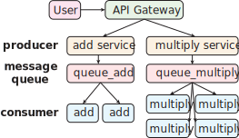

# Microservices Demo

A microservices demo built with [Celery](https://github.com/celery/celery) and [FastAPI](https://github.com/celery/celery).



**Features:**

- launch all with one `docker-compose up`
- services run in isolated docker container
- submit tasks with RESTful API (FastAPI)
- separated task queues
- concurrence control
- tasks monitor

## Quick Start

**Launch the demo:**

``` sh
docker-compose up
```

**Check the page:**

- FastAPI page: http://127.0.0.1:8081/docs
- tasks monitor page (powered by [flower](https://github.com/mher/flower)): http://127.0.0.1:5555

*Note: please change IP address and ports accordingly, they are specified in `docker-compose.yaml`*

**Try the demo:**

- Request `add` or `multiply` services in the FastAPI page and see the interaction process from the log (terminal window of launching `docker-compose`).
- Request `check` api with `task_id` to see the status and the result of the request.
- Check the monitor page to see all submitted tasks.